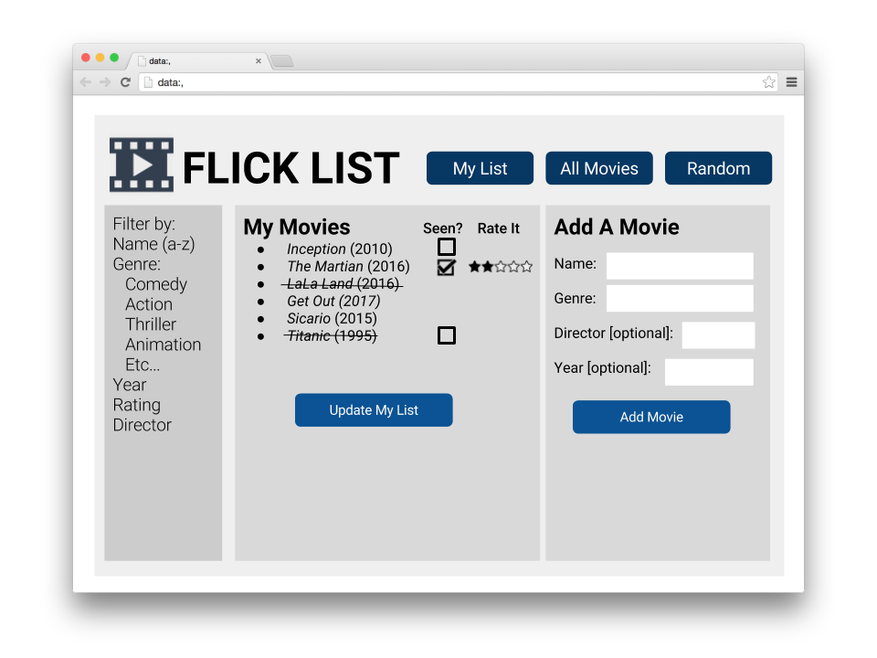
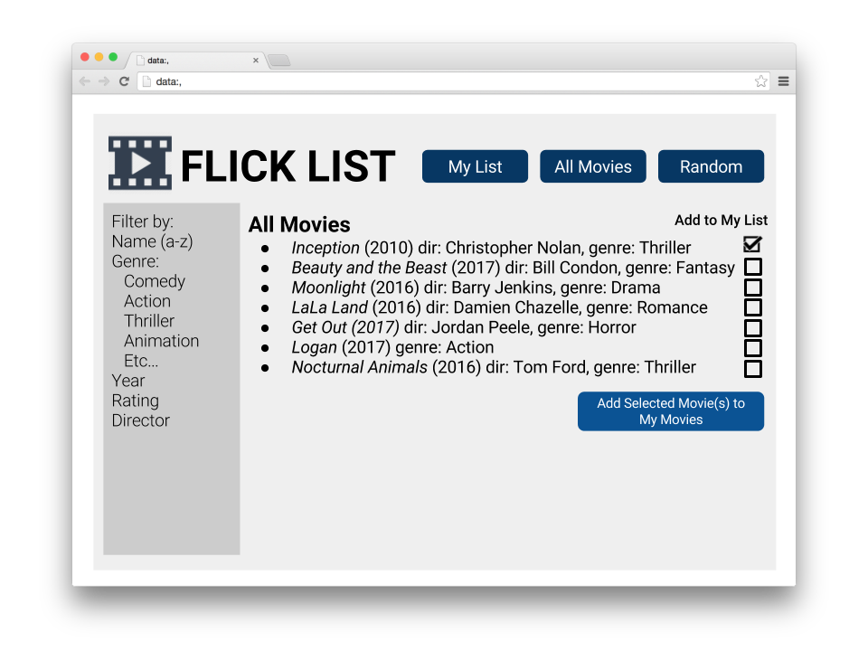
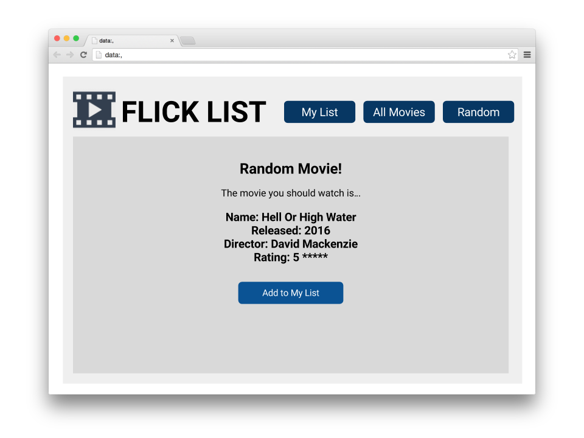
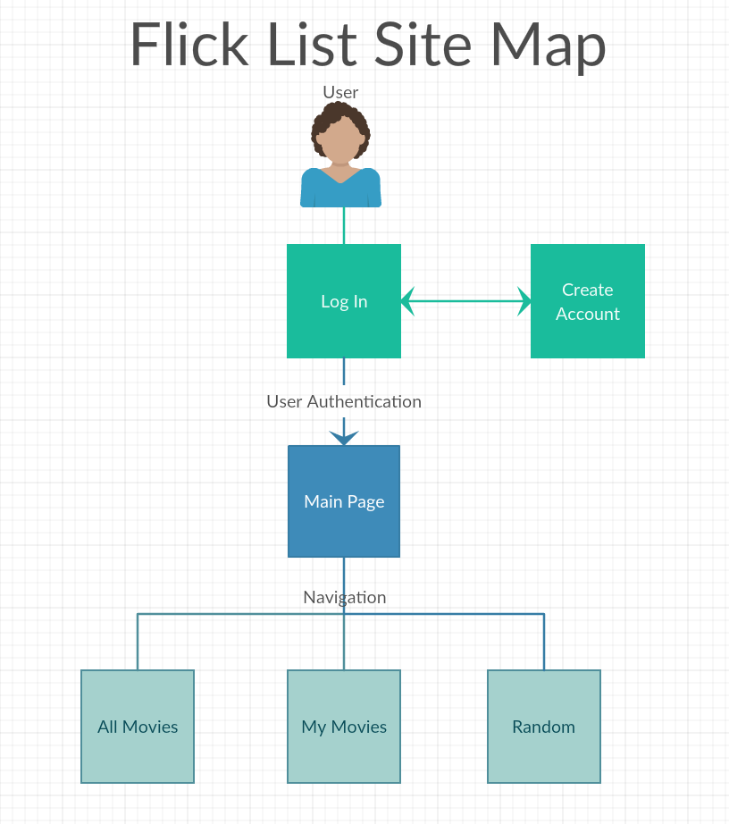

# Flick List

## Overview

Ever found yourself stuck on what movie to watch? Or had someone recommend you a movie, only to forget what it was called?

Flick List is a web app that allows users to keep an aggregate list of movies they want to watch. Users can register and login. Once they're logged in, they can add/delete movies to their personal list, or browse a list of movies collected from all users. Users can check off a movie once they've watched it and rate it. Movies can be filtered based on genre, alphabetical order, rating, etc. Additionally, users have the ability to click on a random button to generate a random movie recommendation from the total list of movies.

## Data Model

The application will store Users and Movies

* each user has a list of movies (via references)

An Example User:

```javascript
{
  username: "movielover",
  hash: // a password hash,
  movies: [ { name: "Moana", seen: false } ] // an array of references to Movies
}
```

An Example Movie:

```javascript
{
  name: "Inception",
  director: "Christopher Nolan",
  year: 2010,
  genre: "Sci-Fi",
  seen: false
}
```


## [Link to Commented First Draft Schema](db.js) 

## Wireframes

/my-movies - page for viewing a user's movie list



/all-movies - page for showing all movies added by all users



/random - page for showing a random movie suggestion



## Site map



## User Stories or Use Cases

1. as non-registered user, I can register a new account with the site
2. as a user, I can log in to the site
3. as a user, I can add a movie to my personal list by creating a new movie or adding one from the existing total movies list
4. as a user, I can view all movies (and filter them based on genre, rating, etc.)
5. as a user, I can cross off a movie that I have watched & rate it.
7. as a user, I can get a random movie recommendation from the total movie list.

## Research Topics

* (5 points) Integrate user authentication
    * I'm going to be using passport for user authentication
    * And account has been made for testing; I'll email you the password
    * see <code>linserv1.cims.nyu.edu:11820/signup</code> for register page
    * see <code>linserv1.cims.nyu.edu:11820/signin</code> for login page
* (4 points) Perform client side form validation using a JavaScript library
    * see <code>linserv1.cims.nyu.edu:11820/signup</code>
    * if you put in a password less than 8 characters, an error message will appear in the dom

9 points total out of 8 required points


## [Link to Initial Main Project File](app.js) 

## Annotations / References Used

1. [passport.js authentication docs](http://passportjs.org/docs)
2. [passport.js tutorial](https://code.tutsplus.com/tutorials/authenticating-nodejs-applications-with-passport--cms-21619)